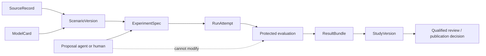

# Earth Rehearsal architecture

Status: **architecture foundation accepted; research runtime not implemented**. Owner: Lucas Santana. Foundation date: 2026-09-07. Acceptance evidence: [STATUS.md](STATUS.md).

## Product boundary

Earth Rehearsal is an open, reproducible environmental study system. Its first job is to answer a narrow question about pollutant mass in a synthetic watershed. It may later connect domain solvers, but a connection is accepted only for an explicit scientific purpose and applicability range.

The platform can establish software behavior, numerical agreement with known answers, and agreement with declared datasets. It cannot establish safe drinking water, ecological recovery, avoided disease, site suitability, regulatory compliance, or net environmental benefit without the corresponding observations, boundary definition and qualified review. Capture moves material into another managed state; it never makes mass, risk, energy demand or waste disappear.

Agents may propose specifications, parameters and interpretations. Versioned numerical engines and protected evaluators alone calculate accepted metrics and invalidity decisions. No agent response is a scientific result.

## Domain model: separate physics, explicit applicability

The architecture is a study kernel with process-isolated adapters, not one universal Earth solver. Each adapter publishes a `ModelCard`, consumes an accepted `ScenarioVersion`, and returns quantities at declared spatial and temporal supports.

| Domain | Planned governing representation | Earliest supported use | Must not be inferred | Applicability falsifier |
| --- | --- | --- | --- | --- |
| Catchment rainfall–runoff | Water-balance compartments first; later an EPA SWMM adapter for subcatchment runoff and drainage routing | Synthetic hydrographs and water-volume accounting | Site flood prediction from invented parameters | Water balance fails, forcing lies outside calibrated range, or routing choice changes the decision |
| Drainage/channel hydraulics | Kinematic routing where its assumptions hold; one-dimensional Saint-Venant/dynamic-wave adapter where backwater, reversal or pressurization matters | Reproduction of an official engine example before project scenarios | Two-dimensional inundation, groundwater exchange or habitat hydraulics | Omitted hydraulic process controls the metric or refinement does not converge |
| Pollutant/particle fate | Conservative compartments, then finite-volume advection–dispersion with explicit aqueous, suspended, bed, bank, captured and escaped states | Known-answer transport and bounded synthetic particle classes | Universal microplastic settling, fragmentation or toxicity | Results rely on unconstrained settling/resuspension/fragmentation constants or particle properties outside the model card |
| Source reduction and interception | Event-sourced stock/flow accounting around the transport solver | Paired intervention arms with equal forcing | That downstream capture is equivalent to prevention | Source and capture effects are not separately identifiable, or any mass is silently removed |
| Captured-material lifecycle | Foreground inventory of collection, storage, transport, sorting, leakage, treatment, recovery and final disposal; energy/emissions remain separate ledgers | Scenario comparison with every terminal destination named or marked unknown | Circularity, avoided production, health benefit or net benefit from capture alone | A downstream stage is omitted, counted twice, or uses an unsupported substitution credit |
| Pressurized water distribution | EPA EPANET adapter for hydraulic state, water age, source tracing and supported constituent reactions | Official network example and declared constituent kinetics | Treatment efficacy or potability | Reaction coefficients lack site evidence or the question requires chemistry outside EPANET's representation |
| Treatment train | Separate ideal-reactor or empirical unit-operation adapters with residual streams, dose and energy inputs | Bench-scale hypotheses within a unit operation's model card | Regulatory removal credit or potable output | Performance is extrapolated across feedwater, scale, fouling or operating regime |
| Wetland/restoration | Water and constituent budgets coupled to a separately reviewed empirical response model | Directional, site-bounded restoration hypotheses | Biodiversity gain, permanence or ecosystem-service benefit from hydrology alone | Response model lacks independent observations, omits displaced harm, or transfers outside its biome/scale |
| Urban cooling | Surface energy/water balance or validated empirical temperature response at declared morphology and weather range | Relative synthetic comparisons | Mortality reduction or neighborhood equity outcome | Boundary weather, morphology or irrigation regime lies outside evidence, or energy/water trade-offs reverse the ranking |
| Climate extension | Reanalysis as historical boundary evidence; projections as scenario-conditioned inputs with model/internal/forcing uncertainty kept distinct | Stress-testing an already validated local model | Local prediction from a coarse cell or a single ensemble statistic | Relevant regional process is unresolved or ensemble/model choice changes the conclusion |

SWMM, EPANET, ERA5 and other named tools are candidates for version-specific evaluation, not installed or approved dependencies. Their official capabilities define a possible adapter boundary; Earth Rehearsal must establish fitness for each study. A specialized groundwater, two-dimensional flood, reactive-chemistry, ecological-population or atmospheric-dispersion solver is a new domain decision, not a flag on an existing adapter.

## Scientific applicability ladder

Each claim carries one of these scopes; later scopes require all earlier evidence relevant to the claim:

1. `A0_KNOWN_ANSWER`: algebraic or manufactured case checks implementation and conservation only.
2. `A1_SYNTHETIC`: internally coherent scenario explores model behavior; no field transfer.
3. `A2_CALIBRATED_CONTEXT`: parameters estimated from a declared development dataset and identifiable enough for the stated use.
4. `A3_INDEPENDENTLY_CONFIRMED_CONTEXT`: frozen model evaluated against data or cases excluded from calibration and search.
5. `A4_DECISION_CONTEXT_REVIEWED`: exact decision, alternatives, uncertainty, rights and harmful outcomes reviewed by qualified people. This is still decision support, not authority to act.

An artifact reports numerical verification, parameter calibration, independent validation, sensitivity/uncertainty analysis, and domain review as separate fields. Passing one never promotes the others.

## Quantities, coordinates and coupling

Persist quantities with a numeric value, machine-readable unit, physical dimension, sign convention and support. The reference kernel stores calculation values in declared SI units (`m3`, `s`, `kg`, `J`, `K`) while retaining source units and the exact conversion. Concentration is never accepted without numerator and denominator bases; particle count and particle mass are different state variables and may be converted only through a declared size/shape/density model. Carbon dioxide equivalent requires the named characterization method, gases and time horizon.

Every spatial field declares coordinate reference system, horizontal/vertical datum, geometry support (point, line, cell, reach or catchment), cell bounds and missing-data semantics. Every temporal field declares timestamp or interval, timezone/calendar, accumulation versus instantaneous meaning, and interval bounds. Climate and array formats should follow current Climate and Forecast metadata conventions where applicable; choosing a file format does not resolve semantic mismatches.

Coupling is accepted through a versioned `ExchangeContract` containing source and target variable, unit conversion, spatial remap, temporal aggregation/interpolation, conservation expectation, lag, uncertainty propagation and out-of-domain rule. Initial studies use one-way, offline coupling. Two-way iteration is admitted only after an experiment shows feedback materially affects the decision and a convergence criterion is specified.

Conservative extensive quantities use overlap- or flux-weighted remapping. Intensive variables use a scientifically justified method and never borrow conservation semantics. A coupling test must pass a constant-field case, an impulse/step case, a whole-domain balance, a boundary/missing-cell case and a resolution perturbation. Reject a run rather than silently extrapolate, fill, clip or change calendars.

## Conservation and consequence ledgers

For each conserved material `x` and reporting interval:

```text
opening_stock_x + external_inputs_x
  = closing_stock_x + boundary_outputs_x + transformed_x + residual_x
```

`transformed_x` names products and stoichiometry; degradation or fragmentation cannot be a generic sink. The evaluator computes the residual independently from raw state/flux outputs. A tolerance is justified from arithmetic, solver order, timestep/grid behavior and input precision before intervention search. Absolute and scale-normalized residuals are both reported so a near-zero denominator cannot disguise a failure.

Captured pollutant moves to a custody ledger:

```text
captured -> stored -> transported -> sorted -> recovered | treated | disposed | leaked | unknown
```

Every transfer conserves mass and records loss or uncertainty. An `unknown` destination is truthful data and blocks claims of completed disposal or net benefit. Energy is conserved within solver boundaries where relevant and separately inventoried as purchased energy/fuel, recovered energy and rejected heat. Lifecycle emissions, cost, toxicity proxies, land/water use and ecological response are distinct metrics; the system does not collapse them into one score until a reviewed decision rule names weights and trade-offs.

For adapters that solve an energy balance, the evaluator also checks:

```text
opening_stored_energy + imported_work_heat_and_fuel
  = closing_stored_energy + useful_exported_work_and_heat
  + unrecovered_rejected_heat + residual
```

`useful_exported_work_and_heat` contains energy intentionally delivered across the product boundary; `unrecovered_rejected_heat` contains the remaining thermal discharge. They are disjoint and every joule crosses at most one output category. Chemical conversion, phase change and storage terms must be named rather than hidden in rejected heat. A lifecycle energy inventory across organizations is an accounting boundary, not proof of thermodynamic closure inside every upstream process.

## Uncertainty, identifiability and evidence

The study contract separates:

- input/measurement uncertainty;
- parameter uncertainty and covariance;
- numerical discretization and solver tolerance;
- model-form discrepancy and omitted processes;
- scenario/forcing uncertainty;
- stochastic variability; and
- structural unknowns that cannot honestly be assigned a distribution.

Calibration declares the parameters allowed to move, bounds and priors if any, objective function, development observations, optimization budget and identifiability diagnostic. Parameters that trade off without unique support are reported as non-identifiable; the platform may predict an aggregate observable within a bounded context but must not interpret individual fitted values causally. Profile likelihood, posterior diagnostics or sensitivity rank are candidates selected per model, not universal proof.

Validation uses frozen code, parameters and acceptance thresholds on cases excluded from fitting and candidate selection. Spatial or temporal cross-validation must respect dependence; random row splits are rejected when they leak neighboring conditions. Benchmark agreement verifies a numerical implementation only within that benchmark. A reserved case is consumed when its result influences development and is versioned as development evidence thereafter.

Results include negative, null, contradictory and inconclusive outcomes. A favorable metric is invalid if conservation, applicability, rights, budget or evaluator-integrity gates fail. Search reports all attempted candidates and failures so selection does not erase the denominator.

## Versioned study and run contracts



| Contract | Required identity and content |
| --- | --- |
| `SourceRecord` | Provider, canonical URL/DOI, access date, version/retrieval window, license/terms, attribution, redistribution and derivative permissions, original byte identity when lawful to retain, transformations, spatial/temporal coverage, quality flags and limitations |
| `ModelCard` | Adapter/engine version, governing equations, state variables and units, discretization, supported ranges/scales, parameters, calibration evidence, independent validation evidence, numerical tolerances, known invalid states and prohibited interpretations |
| `ScenarioVersion` | Immutable scenario ID/version, source records, geometry/time supports, initial/boundary conditions, forcing, interventions, parameter sets, coupling graph and applicability target |
| `ExperimentSpec` | Question, hypotheses, comparison arms, metrics, invalidity/falsification rules, seeds, calibration/confirmation partitions, evaluator version, allowed adapters/plugins, and CPU/memory/disk/time/run/inference budgets |
| `RunAttempt` | Logical run ID plus attempt number, accepted spec/study version, repository revision, environment lock, actual solver settings/seeds/hardware/threads, lifecycle timestamps, resource use and terminal reason |
| `ResultBundle` | Raw outputs, diagnostics, balance ledgers, evaluator findings, uncertainty components, negative results, partial/failure artifacts, source/model notices and exact reproduction command |
| `StudyVersion` | Frozen set of experiment specs and result bundles, claim table, applicability, contradicting evidence, reviewer roles/decisions and supersession link |

Schemas are versioned and reject unknown execution fields. A study revision creates a new version; it never overwrites an accepted run. Source byte digests may establish intrinsic data identity, but ordinary repository revisions and semantic contract versions identify plans and reviews.

Run lifecycle:

```text
PROPOSED -> ACCEPTED -> QUEUED -> STARTING -> RUNNING -> EVALUATING
         -> SUCCEEDED | NEGATIVE | INCONCLUSIVE
         -> INVALID | FAILED | CANCELLED | BUDGET_EXHAUSTED
```

`NEGATIVE` and `INCONCLUSIVE` are valid evaluated outcomes. `INVALID`, `FAILED`, `CANCELLED` and `BUDGET_EXHAUSTED` cannot support an intervention claim. Retries append an attempt to the same logical run and never overwrite completed evidence.

## Protected execution and evaluator boundary

The coordinator accepts only registered schema versions, adapters, evaluator versions and resource envelopes. Proposal agents cannot write accepted specs, evaluator code, holdouts, raw outputs, result status or publication fields. Evaluators recompute invariants from raw outputs and are versioned separately from candidates; a change reopens affected evidence.

An ordinary subprocess running as the developer account is a process boundary, not a security boundary: it can normally read the account's home directory, credentials, repository files and holdouts. Before enforced isolation exists, the prototype may execute only reviewed built-in code against synthetic development fixtures. It must not execute third-party/untrusted plugins or protected confirmation cases.

Admission of an untrusted plugin requires an official source and license review, pinned version/environment, declared capabilities and file formats, known network/subprocess/native-code behavior, minimal fixture, malformed-output and timeout tests, and rollback. Execution then requires an enforced separate OS identity, container or VM with allowlisted read-only input mounts, one fresh writable scratch/output mount, no home/keychain/SSH/browser/token or holdout visibility, network denied by enforcement, and enforced CPU, memory, wall-time, disk and subprocess limits. Isolation acceptance must demonstrate that attempted reads, writes, network calls and resource overruns are denied; configuration prose or a `shell=False` subprocess is not evidence.

Protected confirmation adds a distinct least-privilege input path: the candidate receives only the accepted scenario interface, while the protected evaluator controls confirmation inputs and writes authoritative status. Outputs cross back only through schema and size validation. In-process untrusted plugins, arbitrary serialized objects and install-at-run-time behavior are prohibited.

Trust may graduate from `QUARANTINED_FIXTURE` to `KNOWN_ANSWER`, `SYNTHETIC_STUDY`, and then a reviewed scientific scope. Trust is adapter-version and claim-specific; it does not transfer to another engine version, dataset or domain.

## Scheduler, budgets and recovery

The first coordinator is a single local command using filesystem bundles and atomic rename. Add SQLite only when durable multi-run claiming is needed. The scheduler reserves estimated CPU, accelerator, memory, disk, wall time, attempt count and agent-inference budget before launch, then records actual use including failures. It must refuse work that cannot fit the remaining campaign envelope.

Each run writes to an attempt-specific temporary directory. Heartbeats and ownership leases make abandoned work detectable. Cancellation first requests graceful termination, then kills the process tree after a declared grace policy, preserves readable diagnostics, accounts incurred resources and records `CANCELLED`. Restart reconciles live processes and leases before dispatch; an orphan can be recovered, failed or retried, never silently duplicated. Publishing a result bundle is atomic and idempotent.

Scale only when measurement demonstrates need:

1. **Local sequential:** default through the first analytic and synthetic studies.
2. **Local bounded parallel:** eligible after replay, cancellation, resource enforcement and duplicate-prevention tests pass, and measured queue delay dominates useful run time without violating memory/disk limits.
3. **Remote single worker:** eligible when an accepted study cannot fit available local hardware or turnaround, portable environments and artifacts reproduce locally/remotely, secrets are absent, and remote failure/cost limits are tested.
4. **Distributed scheduler:** eligible only when multiple independent studies create sustained measured demand, transfer/storage costs are materialized, retries are idempotent, evaluator integrity is preserved and operations ownership/budget are allocated.

No Kubernetes, workflow platform, message broker, vector database or cloud account is justified by the current state. A distributed system is a response to measured workload, not a prerequisite for science.

## Planned repository map

```text
src/                 contracts, coordinator, accounting, evaluation, reports
adapters/            isolated domain engines and exchange boundaries
scenarios/           synthetic or lawfully reusable versioned inputs
benchmarks/          known answers, manufactured cases, confirmation cases
tests/               contract, conservation, coupling, failure, recovery checks
apps/workbench/      later local comparison interface
docs/                model cards, data records, studies, decisions, reviews
plan/                machine-readable contributor dependency graph
tools/               repository and plan validation utilities
```

The directories are intended ownership boundaries. Most do not exist yet.

## Architecture falsifiers and rejected shortcuts

| Observation | Required response |
| --- | --- |
| The box-model reference cannot close water and pollutant mass under hand calculation | Stop implementation, repair the contract/evaluator; no intervention ranking |
| Reasonable timestep, grid, remap or model-form choices reverse a ranking | Report fragility, narrow applicability or collect evidence; do not average away disagreement |
| Source reduction and capture cannot be identified separately from available observations | Report an aggregate effect or redesign the experiment; no causal parameter story |
| Captured mass has no supportable downstream destination | Preserve `unknown`; block disposal, circularity and net-benefit claims |
| A coupled domain requires feedback that one-way exchange cannot reproduce | Add a bounded coupling experiment before two-way architecture |
| A public dataset cannot be redistributed or its version cannot be reconstructed | Retain metadata/retrieval recipe if permitted or substitute a synthetic fixture; do not vendor it |
| A plugin needs broad credentials, network or filesystem access, or isolation cannot prove denial | Reject or isolate/redesign the adapter; do not expose the developer account or protected confirmation material |
| Qualified reviewer or applicability data are unavailable | Stop at numerical/synthetic evidence and label the gap |

Rejected for the foundation: one monolithic multiphysics solver, one generic “removal efficiency,” a single weighted sustainability score, agent-authored acceptance, mutable latest-result files, calibration against confirmation cases, automatic spatial/temporal interpolation, and distributed infrastructure before measured need. These choices would hide the boundary most likely to falsify a result.
