# Earth Rehearsal roadmap

Wave 0 is **DONE**: its three architecture-foundation tasks were accepted by the authorized root after independent review and reproduced checks. All 24 original scientific/build tasks remain **PLANNED** across Waves 1–8. The programme now contains nine waves and 27 tasks; no scientific result or runtime is claimed.

## Product objective

Let researchers simulate environmental interventions before proposing physical experiments: plastic interception, water treatment, runoff prevention, restoration and climate adaptation. Optimize the full system, including displaced pollution, waste disposal, energy use and ecological tradeoffs.

## First milestone

Create a synthetic watershed with a transparent flow and particle mass-balance model. Compare no intervention, source reduction and simulated interception under dry and storm conditions. Report retained, escaped, captured and disposed mass, costs and uncertainties. No real treatment equipment or field experiment is part of the project.

Wave 0 makes the programme executable. Waves 1–3 establish the first integrated experiment. Wave 4 tests whether its evidence is robust. Later waves expand domains, add agents, improve collaboration and prepare an independently reproduced research preview. Wave order is an integration dependency, not a calendar. The explicit task dependencies are in [TASKS.md](TASKS.md).

## Outcome and dependency logic

```mermaid
flowchart LR
  W0[Wave 0: reviewed architecture] --> W1[Wave 1: accepted study contract]
  W1 --> W2[Wave 2: verified conservative kernels]
  W2 --> W3[Wave 3: reproduced synthetic comparison]
  W3 --> W4[Wave 4: uncertainty and confirmation gate]
  W4 --> W5[Wave 5: separately evidenced domain extensions]
  W5 --> W6[Wave 6: protected budgeted search]
  W6 --> W7[Wave 7: reproducible local workbench]
  W7 --> W8[Wave 8: independently reviewed preview]
```

The critical path is Wave 0 → BOX-001 contract and skeleton → conservative transport/intervention/custody ledgers → first comparison → refinement/holdout evidence. Domain extensions cannot accelerate that path because each introduces different physics and applicability evidence. Qualified review, data rights and source/model evaluation are external dependencies with unknown lead time; they are gates, not implied capacity.

Within Wave 5, drainage/distribution, restoration/cooling, and climate/lifecycle can be investigated independently after the common uncertainty gate. Their results rejoin only through versioned exchange and study contracts. A domain can be deferred without weakening the first watershed milestone. Wave 6 agents depend on protected evaluators and accepted domain evidence; they cannot be used to manufacture that evidence.

## Capacity and next planning window

Assume one maintainer and one implementation owner per coherent surface. Human reviewer availability, hardware and paid-compute budget are currently unallocated. Do not forecast calendar dates until ER-001 and ER-003 produce observed implementation, review and rework effort. Later tasks are outcome packages to split when prerequisites exist. The conservative dependency graph waits for the previous wave's accepted gate. Within a wave, use disjoint work only when dependencies and shared resources permit it.

Proposed initial experiment ceiling for future approval: one local worker, at most 20 trial runs, at most two elapsed compute hours and 5 GiB of new artifacts per campaign. Agent inference costs count toward an explicitly approved budget. These are draft limits, not permission to start or spend. Reduce the workload if the first benchmark cannot fit. GPU, cloud, domain-review time and additional workers need an explicit allocation before execution.

## Waves and tasks

## Wave 0: Architecture and research-programme foundation

Outcome/gate: Maintainer-reviewed architecture, dependency logic and one executable known-answer packet exist without claiming a simulator or scientific result.

Entry: Clean documentation baseline at repository revision `f05ca211968e293e1b5ebc6924d4676e667e0089`.
- **ER-F01: Establish the architecture contract.** Separate solver physics, applicability, quantities/coupling, evidence, study/run contracts, evaluator authority, plugin trust and scale triggers.
- **ER-F02: Establish the outcome and dependency roadmap.** Connect the first benchmark to the original Waves 1–8, scientific gates, resource decisions, cut order and replanning triggers.
- **ER-F03: Specify the executable next-work packet and validate the repository plan.** Make BOX-001 and ER-001 startable without scientific guesswork and provide a standard-library consistency check.

Gate decision: the maintainer reviews all three tasks and records acceptance in [STATUS.md](STATUS.md). Until then they remain `READY_FOR_REVIEW`; no architecture document is implementation or scientific validation.

## Wave 1: Watershed experiment contract

Outcome/gate: One bounded question, lawful inputs and conservation checks are defined.

Entry: ER-F03 accepted with Wave 0 review evidence recorded; inspect the current plan and source before implementation.
- **ER-001: Specify the first pollutant scenario.** Define the synthetic catchment, particle classes, boundary conditions, analytic references and mass-accounting equation.
- **ER-002: Review environmental data and rights.** Record exact source licenses, resolution, date coverage and missing variables; clearly label invented scenario inputs.
- **ER-003: Build the experiment skeleton.** A CLI validates units and source/sink definitions; a hand-computable no-removal case passes.

Gate decision: continue when the outcome is reproduced and reviewed at its appropriate evidence level; otherwise repair, reduce scope or hold. No later wave may weaken this gate.
## Wave 2: Flow, transport and intervention kernels

Outcome/gate: The model conserves quantities and explains intervention effects.

Entry: Wave 1 accepted with its evidence recorded.
- **ER-004: Implement the reference flow/transport model.** Pass closed-box and open-boundary analytical cases with justified residual tolerances.
- **ER-005: Implement source-reduction and capture policies.** Track captured and residual mass separately; no efficiency parameter can silently remove unaccounted mass.
- **ER-006: Add disposal and lifecycle accounting.** Report the destination and energy assumptions for captured waste; detect double counting.

Gate decision: continue when the outcome is reproduced and reviewed at its appropriate evidence level; otherwise repair, reduce scope or hold. No later wave may weaken this gate.
## Wave 3: First cleanup comparison

Outcome/gate: A complete synthetic watershed study is reproducible.

Entry: Wave 2 accepted with its evidence recorded.
- **ER-007: Create dry-weather and storm cases.** Use documented synthetic flow profiles with paired random inputs and all boundary conditions saved.
- **ER-008: Compare three intervention strategies.** Show no intervention, source reduction and capture under equal resource assumptions, including invalid runs.
- **ER-009: Export maps, balances and limitations.** Every figure derives from retained run data and labels simulation, source quality and unknown ecological effects.

Gate decision: continue when the outcome is reproduced and reviewed at its appropriate evidence level; otherwise repair, reduce scope or hold. No later wave may weaken this gate.
## Wave 4: Validation and uncertainty

Outcome/gate: Fragile cleanup rankings are detected before expansion.

Entry: Wave 3 accepted with its evidence recorded.
- **ER-010: Test particle and flow sensitivity.** Vary supported settling, fragmentation and flow parameters; identify rankings that change.
- **ER-011: Validate resolution and numerical stability.** Run timestep/grid refinement and source/sink perturbations; reject unstable or nonconservative runs.
- **ER-012: Create independent holdout scenarios.** Reserve public or synthetic confirmation conditions before search; state whether they validate numerics or environmental realism.

Gate decision: continue when the outcome is reproduced and reviewed at its appropriate evidence level; otherwise repair, reduce scope or hold. No later wave may weaken this gate.
## Wave 5: Water, restoration and climate extensions

Outcome/gate: New environmental domains have their own model evidence.

Entry: Wave 4 accepted with its evidence recorded.
- **ER-013: Integrate drainage and water-network adapters.** Reproduce an official example per chosen engine; do not silently equate pipe quality with treatment performance.
- **ER-014: Add a restoration or urban-cooling case.** Document supported spatial scale, public inputs and ecological/thermal response limitations.
- **ER-015: Add climate and lifecycle scenarios.** Separate historical data, projections and intervention assumptions; account for energy and emissions without geoengineering control.

Gate decision: continue when the outcome is reproduced and reviewed at its appropriate evidence level; otherwise repair, reduce scope or hold. No later wave may weaken this gate.
## Wave 6: Agent-guided environmental experiments

Outcome/gate: Agents explore robust interventions with traceable assumptions.

Entry: Wave 5 accepted with its evidence recorded.
- **ER-016: Build source-backed hypotheses.** Require evidence, a measurable outcome and a failure condition for every proposed intervention.
- **ER-017: Compare budgeted search methods.** Use equal simulation budgets and the same ecological constraints; retain all proposals and failed runs.
- **ER-018: Confirm robust intervention tradeoffs.** Retest shortlisted strategies on holdouts; reject gains that only displace pollution across the modeled boundary.

Gate decision: continue when the outcome is reproduced and reviewed at its appropriate evidence level; otherwise repair, reduce scope or hold. No later wave may weaken this gate.
## Wave 7: Open study workbench

Outcome/gate: Contributors can inspect interventions and reproduce bundles.

Entry: Wave 6 accepted with its evidence recorded.
- **ER-019: Build a local watershed comparison view.** Accessible maps/tables expose units, waste destinations and uncertainty without implying real-world cleanup.
- **ER-020: Add bounded batch workers.** Limit compute and storage; cancellation/recovery preserve completed evidence and mark partial studies.
- **ER-021: Package portable environmental studies.** Another contributor reproduces a case offline with lawful fixtures and complete metadata.

Gate decision: continue when the outcome is reproduced and reviewed at its appropriate evidence level; otherwise repair, reduce scope or hold. No later wave may weaken this gate.
## Wave 8: Independent environmental preview

Outcome/gate: A release candidate makes only supported research claims.

Entry: Wave 7 accepted with its evidence recorded.
- **ER-022: Replicate a second catchment case.** An independent contributor reproduces a new scenario and documents transfer failures.
- **ER-023: Review environmental and usability claims.** A domain reviewer checks conservation and ecological interpretation; a user completes a comparison/export workflow.
- **ER-024: Prepare the research preview release.** Include limitations, known invalid cases, source notices and maintainer approval; no field-deployment claim.

Gate decision: continue when the outcome is reproduced and reviewed at its appropriate evidence level; otherwise repair, reduce scope or hold. No later wave may weaken this gate.

## Acceptance and release

Numerical benchmarks, source rights, failure behavior and an end-to-end reproduction take precedence over task counts. Scientific extensions need their own applicability evidence; domain reviewer availability is a real dependency. High-risk interpretations require an independent qualified reviewer. A software preview can pass without demonstrating a novel scientific improvement; state the distinction explicitly.

All source and clinical/environmental/privacy/performance claims stay within [EXPERIMENTS.md](EXPERIMENTS.md). A final release needs the exact candidate, clean reproducibility instructions, lawful inputs, resolved material defects and maintainer approval. No production deploy, physical action or unrestricted autonomous execution is included.

## Stop and reduce-scope rules

Stop ranking if mass does not close or results depend on unvalidated removal constants. If finer resolution reverses a ranking, report model uncertainty and collect better public evidence. Cut global-climate ambition before weakening the first watershed benchmark.

Stop a campaign when its approved budget is exhausted, the evaluator is compromised, required provenance is missing or the task crosses its safety boundary. Do not keep adding agents to rescue an unsupported hypothesis. Cut rich visuals, distributed compute and additional domains before the initial benchmark. Reforecast after accepted task evidence, not from speculative agent throughput.

Replan the affected path when a known-answer case fails, an assumed solver boundary omits a decision-controlling process, source rights prevent reproduction, calibration parameters are non-identifiable, confirmation contradicts development results, model/refinement choice reverses an intervention ranking, a qualified reviewer rejects applicability, or observed task/review effort invalidates the active packet size. Preserve negative evidence and change only the impacted claims and dependencies.

Scope cuts proceed in this order: polished/photorealistic presentation; distributed and then local parallel execution; autonomous search; additional climate/restoration/water-system domains; spatial resolution and scenario breadth. Preserve source rights, explicit units/support, conservation and custody ledgers, evaluator independence, negative outcomes, BOX-001, and one reproducible synthetic watershed comparison.
